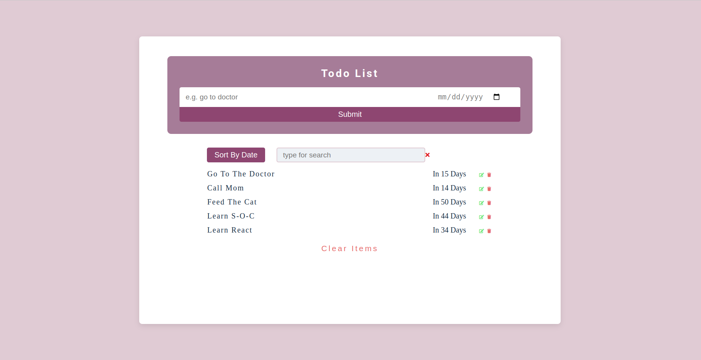

# Todo list project

## Table of contents

- [General info](#general-info)
- [Screenshots](#screenshots)
- [Technologies](#technologies)
- [Setup](#setup)
- [Features](#features)
- [Status](#status)

## General info

> The objective of the project is to practice separation of concern in
> JavaScript. Also the goal is to practice array methods, functional programming, dates and DOM manipulations.

## Screenshots

## Technologies

- JavaScript
- HTML5
- CSS3
- VSC code

## Setup

clone the repo and start using the stop watch.

## Features
1. I added a date input to the todo form and each todo has its due date which stores in the initial data array. In UI the user can see the due date: e.g. "Today", "In 1 Day". When the user clicks the edit icon he is able to edit the due date too.
2. The button "Sort By Date" is added for sorting the todos by due date. Once this button is clicked its inner text changes to "Return To List" which returns the todos to the initial state.
3. The second input is for search. The list of todos is filtered depending the search input value.
4. The clear icon near the search input clears the input's value and returns the initial todo list.
5. I added 2 util functions: sortFunction(sorts the odject with data (data.items) by due date) and findDeltaOfDates (finds the delta between 2 dates in days without taking into account the time).
6. Unit tests are written for a component function and 2 util functions.

## Status

Project is: _done_
